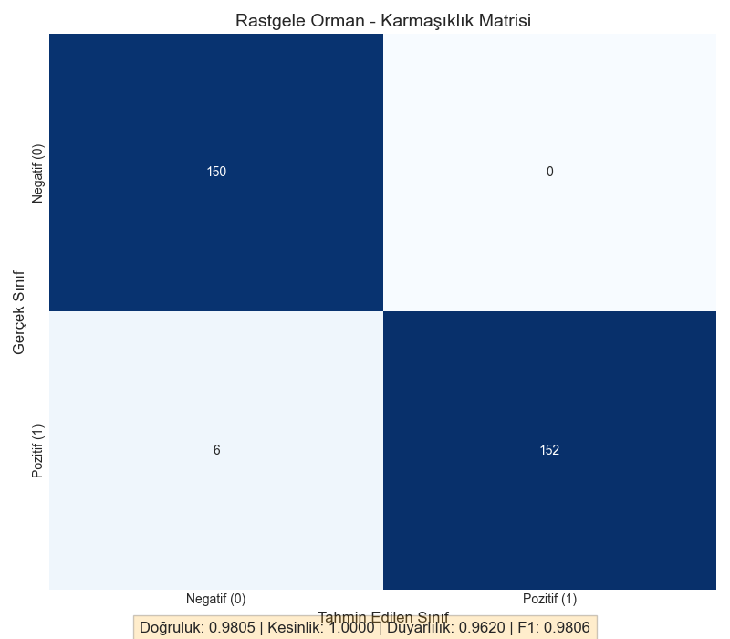

# Kalp Hastalığı Tahmin Projesi

## Proje Açıklaması
Bu proje, gözetimli öğrenme algoritmalarını kullanarak kalp hastalığı riskini tahmin etmek amacıyla geliştirilmiştir. Makine öğrenmesi modellerinin sağlık alanındaki uygulamalarına bir örnek teşkil etmektedir.

## Veri Seti
Projede kullanılan kalp hastalığı veri seti, hastaların çeşitli özelliklerini ve kalp hastalığı teşhisini içermektedir. Veri seti aşağıdaki değişkenleri içermektedir:

- **Sayısal Değişkenler**: yaş (age), istirahat tansiyonu (trestbps), kolesterol (chol), maksimum kalp atış hızı (thalach), ST depresyonu (oldpeak)
- **Kategorik Değişkenler**: cinsiyet (sex), göğüs ağrısı tipi (cp), açlık kan şekeri (fbs), elektrokardiyografik sonuçlar (restecg), egzersiz kaynaklı anjina (exang), ST segmenti eğimi (slope), ana damarların sayısı (ca), talasemi (thal)
- **Hedef Değişken**: kalp hastalığı varlığı (target) - 1: var, 0: yok

## Proje Aşamaları

### 1. Veri Ön İşleme
- Veri setindeki eksik değerler kontrol edildi (eksik değer bulunmadı)
- Sayısal değişkenlere StandardScaler uygulandı
- Kategorik değişkenlere OneHotEncoder uygulandı
- Veri seti eğitim (%70) ve test (%30) olarak bölündü

### 2. Model Seçimi ve Değerlendirme
Üç farklı makine öğrenmesi algoritması değerlendirildi:
- Lojistik Regresyon 
- Karar Ağacı
- Rastgele Orman

Çapraz doğrulama sonuçlarına göre en iyi performans gösteren algoritma **Rastgele Orman** olarak belirlendi. Bu model üzerinde hiperparametre optimizasyonu gerçekleştirildi.

### 3. Model Performansı
Optimizasyon sonrası elde edilen Rastgele Orman modelinin test veri seti üzerindeki performans metrikleri:

- **Doğruluk (Accuracy):** %98.05
- **Kesinlik (Precision):** %100.00
- **Duyarlılık (Recall):** %96.20
- **F1 Skoru:** %98.05
- **AUC Skoru:** %98.10

### 4. Performans Görselleştirmeleri

#### Performans Metrikleri


#### Karmaşıklık Matrisi (Confusion Matrix)


#### ROC Eğrisi


## Gerçek Hayat Uygulamaları

Bu proje aşağıdaki alanlarda kullanılabilir:

1. **Erken Teşhis ve Risk Değerlendirmesi**: Hastanelerde ve sağlık kuruluşlarında hastaların kalp hastalığı risklerini erken aşamada belirlemeye yardımcı olabilir.

2. **Klinik Karar Destek Sistemleri**: Doktorlara tanı koyma sürecinde destek sağlayarak, hızlı ve doğru kararlar alınmasına yardımcı olabilir.

3. **Önleyici Sağlık Hizmetleri**: Yüksek risk grubundaki bireylerin belirlenmesi ve bu kişilere uygun önleyici sağlık hizmetlerinin sunulması için kullanılabilir.

4. **Sağlık Sigortası Risk Değerlendirmesi**: Sigorta şirketleri, poliçe sahiplerinin risk profillerini daha doğru bir şekilde değerlendirmek için bu tür modelleri kullanabilir.

## Projenin Geliştirilmesi İçin Öneriler

Bu proje aşağıdaki yöntemlerle daha da geliştirilebilir:

1. **Daha Büyük ve Çeşitli Veri Seti**: Farklı demografik özelliklere sahip daha büyük bir veri seti kullanılarak modelin genelleme kabiliyeti artırılabilir.

2. **Ek Özellikler**: Hastaların yaşam tarzı, aile geçmişi, genetik faktörler gibi ek özellikler modele dahil edilerek tahmin performansı artırılabilir.

3. **Derin Öğrenme Modelleri**: Özellikle büyük veri setleri için derin öğrenme modelleri (örneğin, derin sinir ağları) kullanılarak daha karmaşık ilişkiler modellenebilir.

4. **Zamansal Veri Analizi**: Hastaların zaman içindeki sağlık durumu değişimleri izlenerek, dinamik risk tahminleri yapılabilir.

5. **Açıklanabilir Yapay Zeka**: Modelin kararlarını daha şeffaf hale getirmek için SHAP değerleri veya LIME gibi açıklanabilir yapay zeka teknikleri uygulanabilir.

6. **Mobil Uygulama Entegrasyonu**: Projenin bir mobil uygulama ile entegre edilmesi, kullanıcıların kendi risk durumlarını takip etmelerine olanak sağlayabilir.

7. **Çevrimiçi Öğrenme**: Sistem, yeni gelen verilerle sürekli olarak kendini güncelleyebilen bir çevrimiçi öğrenme modeline dönüştürülebilir.

## Sonuç

Bu proje, makine öğrenmesi teknikleri kullanılarak kalp hastalığı riski tahmini için başarılı bir model geliştirmiştir. Rastgele Orman algoritması, %98.05 doğruluk ve %100 kesinlik değerleri ile oldukça yüksek bir performans sergilemiştir. Bu, modelin kalp hastalığı riski taşıyan hastaları büyük bir doğrulukla tanımlayabildiğini göstermektedir.

Kalp hastalıkları, Türkiye ve dünyada önde gelen ölüm nedenlerinden biridir. Erken teşhis, tedavinin başarısını ve hayatta kalma oranlarını önemli ölçüde artırabilir. Bu tür makine öğrenmesi modelleri, sağlık uzmanlarına hastaların risk durumlarını değerlendirmede yardımcı olabilir ve sağlık sisteminin önleyici bakım odaklı olmasına katkıda bulunabilir.

Sonuç olarak, bu proje hem teknik açıdan başarılı bir makine öğrenmesi uygulaması olmuş, hem de toplum sağlığına fayda sağlama potansiyeli taşıyan değerli bir çalışma ortaya koymuştur.

## Kullanılan Teknolojiler
- Python
- Pandas
- NumPy
- Scikit-learn
- Matplotlib
- Seaborn

## Proje Yapısı
```
KalpHastaligiProjesi/
├── data/                   # Veri dosyaları
│   ├── kalp_hastaligi/     # Ham veri
│   └── processed/          # İşlenmiş veri
├── images/                 # Görselleştirmeler
│   └── model_evaluation/   # Model değerlendirme görselleri
├── models/                 # Eğitilmiş modeller
├── src/                    # Kaynak kodlar
│   ├── veri_on_isleme.py   # Veri ön işleme
│   ├── model_egitimi.py    # Model eğitimi ve optimizasyon
│   └── model_degerlendirme.py  # Model değerlendirme
└── requirements.txt        # Bağımlılıklar
```
https://www.kaggle.com/code/yusufafsar/yusuf-afsar
